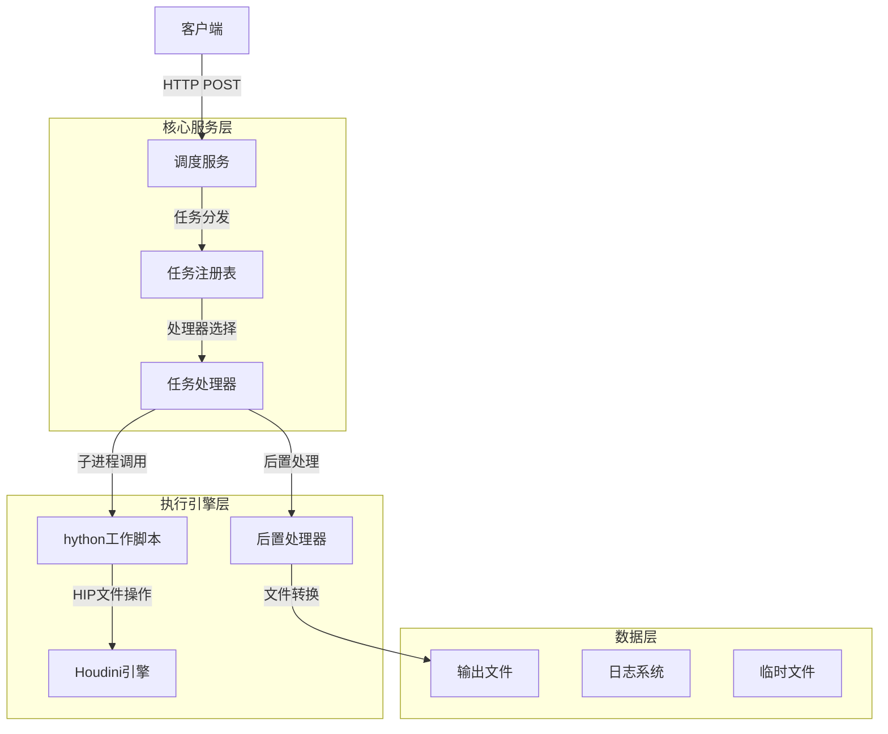
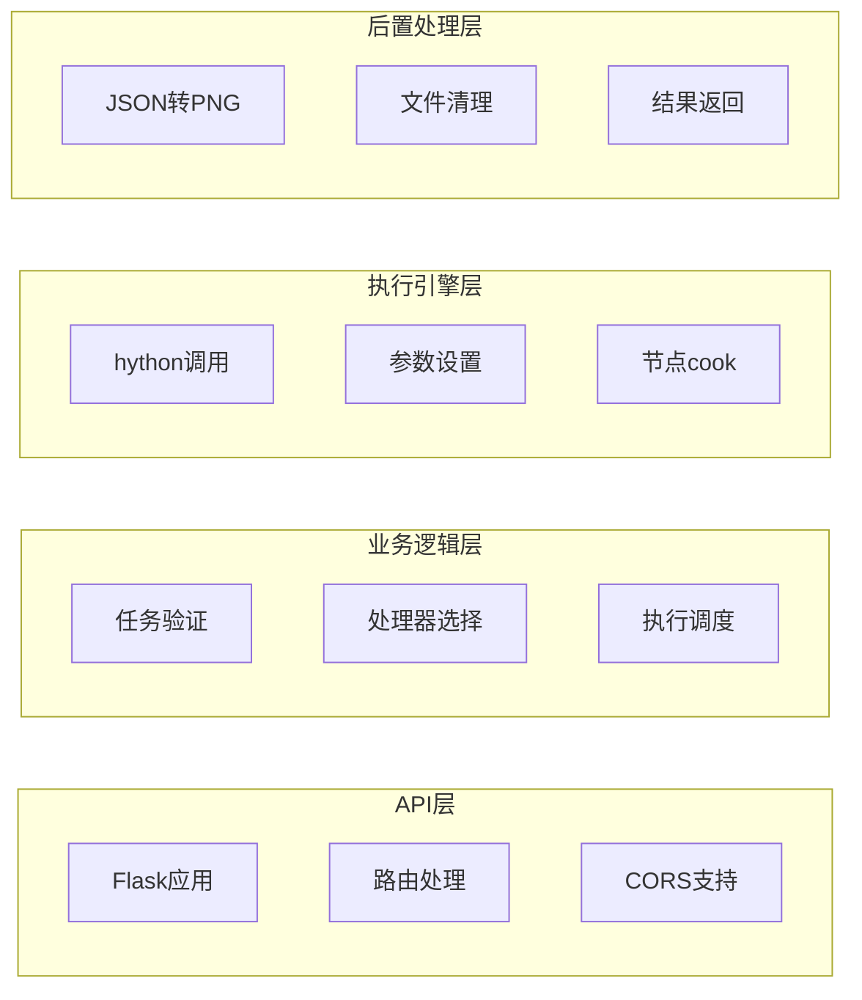
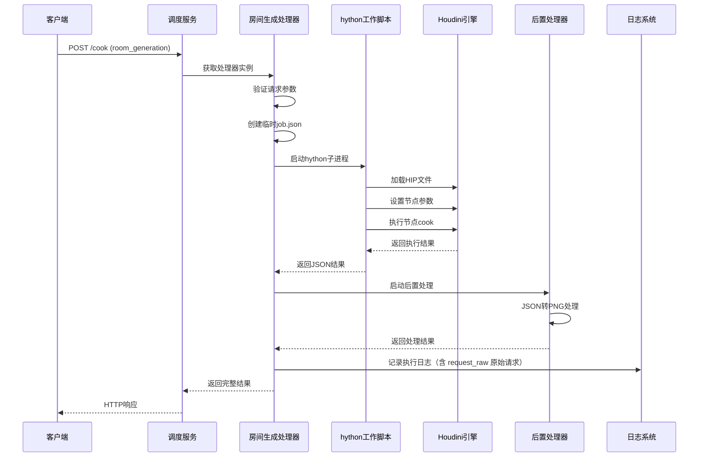
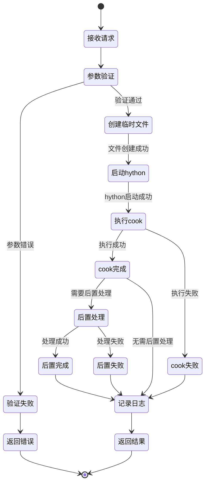
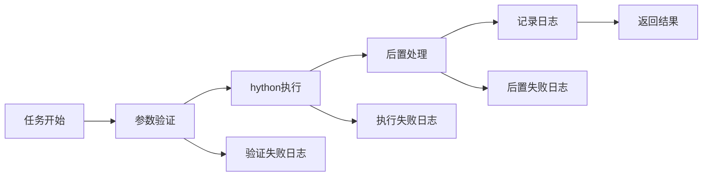
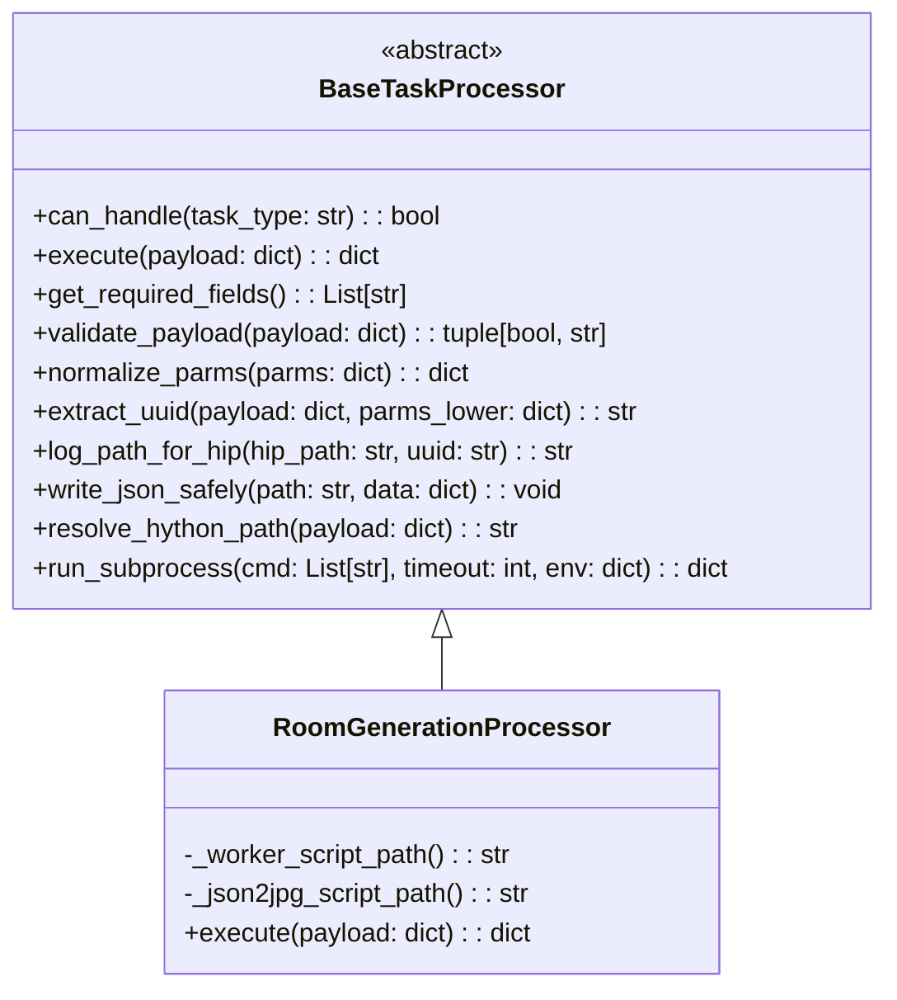
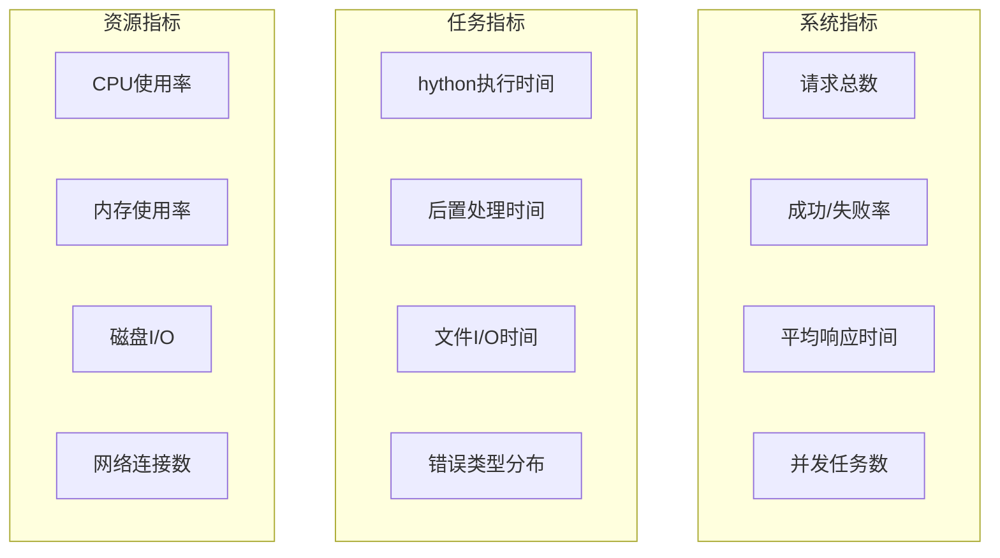

# Houdini后端服务架构笔记

## 目录

*   [系统概述](#系统概述)
*   [架构设计](#架构设计)
*   [核心组件](#核心组件)
*   [通信协议](#通信协议)
*   [工作流程](#工作流程)
*   [日志系统](#日志系统)
*   [扩展机制](#扩展机制)
*   [部署与配置](#部署与配置)
*   [故障排查](#故障排查)

## 系统概述

Houdini后端服务是一个基于插件化任务处理器的HTTP服务系统，主要用于自动化执行Houdini相关任务。系统采用微服务架构，支持多种任务类型的并行处理，包括房间生成、纹理导出、光照烘焙等。

### 主要特性

*   **插件化架构**：支持多种任务类型的处理器
*   **异步处理**：基于子进程的任务执行
*   **容错机制**：完善的错误处理和日志记录
*   **RESTful API**：标准HTTP接口设计
*   **跨平台支持**：支持Windows、macOS、Linux

## 架构设计

### 整体架构图



### 分层架构



## 核心组件

### 1. 调度服务 (dispatcher_server.py)

**职责**：HTTP服务入口、任务路由、响应处理

**核心功能**：

*   Flask Web服务框架
*   CORS跨域支持
*   任务类型验证
*   处理器分发
*   错误处理和响应格式化

**关键接口**：

*   `POST /cook`：执行任务的主要接口
*   `GET /ping`：健康检查
*   `GET /tasks`：获取支持的任务类型

### 2. 任务处理器 (task_processors.py)

**职责**：具体任务的执行逻辑、参数验证、结果处理

**核心类**：

*   `BaseTaskProcessor`：抽象基类（提供通用方法：参数归一、UUID提取、日志写入、子进程执行、hython解析等）
*   `RoomGenerationProcessor`：房间生成处理器（hython + JSON→PNG）

**设计模式**：

*   策略模式：不同任务类型对应不同处理器
*   工厂模式：通过注册表获取处理器实例
*   模板方法：基类提供通用流程和工具函数，子类关注具体步骤

### 3. hython工作脚本 (hython_cook_worker.py)

**职责**：在Houdini环境中执行具体操作

**核心功能**：

*   HIP文件加载
*   节点参数设置
*   节点cook执行
*   错误收集和报告
*   结果序列化

## 通信协议

### HTTP请求格式

#### 主要接口：POST /cook

**请求头**：

    Content-Type: application/json

**请求体结构**：

```json
{
  "task_type": "room_generation",
  "hip": "C:/path/to/file.hip",
  "cook_node": "/obj/geo1/OUT",
  "parm_node": "/obj/geo1/INPUT",
  "uuid": "123e4567-e89b-12d3-a456-426614174000",
  "parms": {"area_layout_seed": 9624, "room_file": "<uuid>.json"},
  "hython": "C:/Program Files/Side Effects Software/Houdini 19.5.716/bin/hython.exe",
  "hfs": "C:/Program Files/Side Effects Software/Houdini 19.5.716",
  "timeout_sec": 600,
  "post_timeout_sec": 10,
  "post_wait_sec": 5
}
```

### 响应格式

**成功响应**：

```json
{
  "ok": true,
  "cook_node": "/obj/geo1/OUT",
  "parm_node": "/obj/geo1/INPUT",
  "elapsed_ms": 1234,
  "node_errors": [],
  "missing_parms": [],
  "parms": {"area_layout_seed": 9624, "room_file": "<uuid>.json"},
  "elapsed_ms_dispatch": 1456,
  "post": {
    "ok": true,
    "returncode": 0,
    "elapsed_ms_post": 234,
    "json": {
      "ok": true,
      "uuid": "<uuid>",
      "path_json": "<hip_dir>/export/serve/<uuid>.json",
      "path_png": "<hip_dir>/export/serve/<uuid>.png",
      "exists": true,
      "width": 64,
      "height": 64,
      "pixels_written": 4096
    }
  }
}
```

**错误响应**：

```json
{
  "ok": false,
  "error": "错误描述",
  "traceback": "详细错误堆栈"
}
```

## 工作流程

### 房间生成任务完整流程



### 任务执行状态流转



## 日志系统

### 日志文件结构

**日志目录**：`{HIP文件目录}/export/serve/log/`
**日志文件**：`{UUID}.json`

**日志内容结构**：

```json
{
  "uuid": "任务唯一标识",
  "ok": true,
  "elapsed_ms_dispatch": 1234,
  "returncode": 0,
  "stdout": "...",
  "stderr": "...",
  "worker_json": {"ok": true, "cook_node": "/obj/geo1/OUT", "elapsed_ms": 1234},
  "post": {
    "ok": true,
    "returncode": 0,
    "elapsed_ms_post": 234,
    "json": {
      "ok": true,
      "path_json": ".../export/serve/<uuid>.json",
      "path_png": ".../export/serve/<uuid>.png",
      "width": 64,
      "height": 64,
      "pixels_written": 4096
    }
  },
  "request": {
    "task_type": "room_generation",
    "hip": "HIP文件路径",
    "cook_node": "cook节点路径",
    "parm_node": "parm节点路径",
    "parms": {"area_layout_seed": 9624, "room_file": "<uuid>.json"}
  },
  "request_raw": { /* 完整原始请求体 */ }
}
```

### 日志记录时机



## 扩展机制

### 添加新任务类型

**步骤1**：创建新的处理器类

```python
class NewTaskProcessor(BaseTaskProcessor):
    def can_handle(self, task_type: str) -> bool:
        return task_type == "new_task"
    
    def get_required_fields(self) -> List[str]:
        return ["hip", "new_field", "uuid"]
    
    def execute(self, payload: dict) -> dict:
        # 实现具体逻辑
        pass
```

**步骤2**：注册到处理器注册表

```python
TASK_PROCESSORS = {
    "room_generation": RoomGenerationProcessor(),
    "new_task": NewTaskProcessor(),
}
```

**步骤3**：更新API文档和测试

### 处理器接口规范



## 部署与配置

### 环境要求

**Python环境**：

*   Python 3.7+
*   Flask框架：`pip install flask`
*   Pillow图像库：`pip install pillow`

**Houdini环境**：

*   Houdini 18.0+
*   hython可执行文件路径

### 启动命令

```bash
# 基本启动
python houdini/dispatcher_server.py

# 指定主机和端口
python houdini/dispatcher_server.py --host 0.0.0.0 --port 5050

# 调试模式
python houdini/dispatcher_server.py --debug
```

### 配置文件

**环境变量配置**：
*   将项目的环境变量添加到houdini的环境变量中

**服务配置**：

*   默认端口：5050
*   默认主机：0.0.0.0
*   超时设置：600秒（可配置）
*   后置处理超时：10秒（可配置）

## 故障排查

### 常见问题

**1. hython启动失败**

*   检查HFS环境变量
*   验证hython.exe路径
*   确认Houdini安装完整性

**2. HIP文件加载失败**

*   检查文件路径正确性
*   确认文件权限
*   验证HIP文件完整性

**3. 节点cook失败**

*   检查节点路径
*   验证节点参数
*   查看Houdini错误日志

**4. 后置处理失败**

*   检查JSON输出格式
*   验证文件路径
*   确认等待时间设置

### 调试技巧

**启用详细日志**：

```python
# 在dispatcher_server.py中设置
app.run(debug=True, use_reloader=False)
```

**检查临时文件**：

*   job.json：任务配置
*   result.json：执行结果
*   日志文件：完整执行记录（包含 request_raw 原始请求）

**性能监控**：

*   执行时间统计
*   内存使用监控
*   并发任务数量

### 监控指标



***