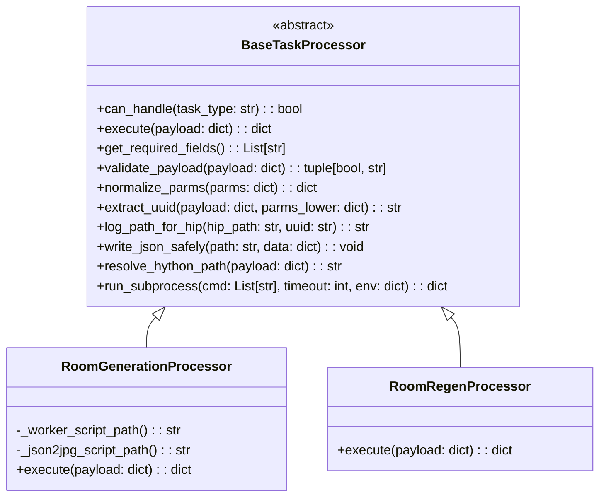

# Houdini后端服务架构笔记

## 目录

*   [系统概述](#系统概述)
*   [架构设计](#架构设计)
*   [核心组件](#核心组件)
*   [通信协议](#通信协议)
*   [工作流程](#工作流程)
*   [日志系统](#日志系统)
*   [扩展机制](#扩展机制)
*   [部署与配置](#部署与配置)
*   [故障排查](#故障排查)

## 系统概述

Houdini后端服务是一个基于插件化任务处理器的HTTP服务系统，主要用于自动化执行Houdini相关任务。系统采用微服务架构，支持多种任务类型的并行处理，包括房间生成、纹理导出、光照烘焙等。

### 主要特性

*   **插件化架构**：支持多种任务类型的处理器
*   **异步处理**：基于子进程的任务执行
*   **容错机制**：完善的错误处理和日志记录
*   **RESTful API**：标准HTTP接口设计
*   **跨平台支持**：支持Windows、macOS、Linux

## 架构设计

### 整体架构图

```mermaid
graph TB
    Client[前端画板\nPiskel] -->|HTTP POST /cook| Dispatcher[调度服务dispatcher_server.py]
    Dispatcher -->|任务分发| TaskRegistry[任务注册表TASK_PROCESSORS]
    TaskRegistry -->|处理器选择| Processor[任务处理器BaseTaskProcessor]
    Processor -->|子进程调用| HythonWorker[hython工作脚本hython_cook_.py]
    HythonWorker -->|HIP文件操作| Houdini[Houdini引擎HDA文件]
    Processor -->|后置处理| PostProcessor[后置处理器json2jpg.py/png2json.py]
    PostProcessor -->|文件转换| Output[输出文件JSON/PNG]

    Processor -->|写入日志| LogSystem[统一日志系统log_system.py]
    LogSystem -->|detail日志| DetailLog[详细日志detail/<uuid>.json]
    LogSystem -->|users日志| UsersLog[用户宏观日志users/<user_id>.json]

    subgraph 前端层
        Client
    end

    subgraph 后端服务层
        Dispatcher
        TaskRegistry
        Processor
    end

    subgraph 执行引擎层
        HythonWorker
        Houdini
        PostProcessor
    end

    subgraph 数据层
        LogSystem
        TempFiles[临时文件]
        Output
        DetailLog
        UsersLog
    end
```

### 分层架构

```mermaid
graph LR
    subgraph "🟦 前端层"
        A[Piskel画板]
        B[PCG控制器]
        C[用户设置管理]
    end
    
    subgraph "🟩 后端服务层"
        D[Flask应用]
        E[任务路由]
        F[参数验证]
    end
    
    subgraph "🟨 执行引擎层"
        G[任务处理器]
        H[hython调用]
        I[后置处理]
    end
    
    subgraph "🟥 数据层"
        J[统一日志系统]
        K[文件存储]
        L[临时文件]
    end
```



## 核心组件

### 1. 调度服务 (dispatcher_server.py)

**职责**：HTTP服务入口、任务路由、响应处理

**核心功能**：

*   Flask Web服务框架
*   CORS跨域支持
*   任务类型验证
*   处理器分发
*   错误处理和响应格式化
*   **用户栈日志管理**：成功响应后写入用户宏观日志

**关键接口**：

*   `POST /cook`：执行任务的主要接口
*   `POST /upload/png`：接收前端上传的PNG文件（用于room_regen任务）
*   `GET /result/png`：获取生成的PNG文件（用于room_generation任务）
*   `GET /ping`：健康检查
*   `GET /tasks`：获取支持的任务类型

**日志逻辑**：
*   任务执行成功后，检查请求体中的 `user_id`、`request_time`、`hip`、`uuid`
*   调用 `LogSystem.append_or_replace_user_stack()` 更新用户栈日志
*   用户栈日志路径：`export/serve/log/users/{user_id}.json`

### 2. 任务处理器 (task_processors.py)

**职责**：具体任务的执行逻辑、参数验证、结果处理

**核心类**：

*   `BaseTaskProcessor`：抽象基类（提供通用方法：参数归一、UUID提取、日志写入、子进程执行、hython解析等）
*   `RoomGenerationProcessor`：房间生成处理器（hython + JSON→PNG）
*   `RoomRegenProcessor`：房间信息更新处理器（PNG→JSON + hython pressButton）

**日志集成**：
*   统一调用 `LogSystem.write_detail_log()` 写入详细日志
*   详细日志路径：`export/serve/log/detail/{uuid}.json`

**设计模式**：

*   策略模式：不同任务类型对应不同处理器
*   工厂模式：通过注册表获取处理器实例
*   模板方法：基类提供通用流程和工具函数，子类关注具体步骤

### 3. hython工作脚本

**职责**：在Houdini环境中执行具体操作

**核心功能**：

*   HIP文件加载
*   节点参数设置
*   节点cook执行
*   错误收集和报告
*   结果序列化

**具体实现**：

*   `hython_cook_worker.py`：房间生成任务（设置参数 + cook节点）
*   `hython_cook_press.py`：房间信息更新任务（设置参数 + 按下execute按钮）

## 通信协议

### HTTP请求格式

#### 主要接口：POST /cook

**请求头**：

    Content-Type: application/json

**请求体结构**：

```json
{
  "task_type": "room_generation",  // 或 "room_regen"
  "hip": "C:/path/to/file.hip",
  "cook_node": "/obj/geo1/OUT",
  "parm_node": "/obj/geo1/INPUT",
  "uuid": "123e4567-e89b-12d3-a456-426614174000",
  "parms": {"area_layout_seed": 9624, "room_file": "<uuid>.json"},  // room_generation
  // 或 "parms": {"room_recalculate_file": "<uuid>", "room_recalculate_input": "<uuid>"}  // room_regen
  "hython": "C:/Program Files/Side Effects Software/Houdini 19.5.716/bin/hython.exe",
  "hfs": "C:/Program Files/Side Effects Software/Houdini 19.5.716",
  "timeout_sec": 600,
  "post_timeout_sec": 10,
  "post_wait_sec": 5
}
```

**支持的任务类型**：

*   `room_generation`：房间生成任务（参数设置 + cook节点 + JSON→PNG）
*   `room_regen`：房间信息更新任务（PNG→JSON + 参数设置 + pressButton）

### 响应格式

**成功响应**：

```json
{
  "ok": true,
  "cook_node": "/obj/geo1/OUT",
  "parm_node": "/obj/geo1/INPUT",
  "elapsed_ms": 1234,
  "node_errors": [],
  "missing_parms": [],
  "parms": {"area_layout_seed": 9624, "room_file": "<uuid>.json"},
  "elapsed_ms_dispatch": 1456,
  "post": {
    "ok": true,
    "returncode": 0,
    "elapsed_ms_post": 234,
    "json": {
      "ok": true,
      "uuid": "<uuid>",
      "path_json": "<hip_dir>/export/serve/<uuid>.json",
      "path_png": "<hip_dir>/export/serve/<uuid>.png",
      "exists": true,
      "width": 64,
      "height": 64,
      "pixels_written": 4096
    }
  }
}
```

**错误响应**：

```json
{
  "ok": false,
  "error": "错误描述",
  "traceback": "详细错误堆栈"
}
```

## 工作流程-部分示例

### 任务流程对比

| 特性 | room_generation | room_regen |
|------|----------------|------------|
| **输入** | 参数设置 | 参数设置 + PNG文件上传 |
| **处理** | hython cook节点 | PNG→JSON转换 + hython pressButton |
| **输出** | JSON + PNG文件 | 仅执行结果（无文件输出） |
| **文件流** | 无 → JSON → PNG | PNG → JSON → 无 |
| **用途** | 生成初始房间布局 | 基于现有布局更新房间信息 |

### 房间生成任务完整流程

```mermaid
sequenceDiagram
    participant Client as 🟦前端画板
    participant Dispatcher as 🟩调度服务
    participant Processor as 🟩房间生成处理器
    participant Hython as 🟨hython工作脚本
    participant Houdini as 🟨Houdini引擎
    participant PostProc as 🟨后置处理器
    participant LogSystem as 🟥统一日志系统

    Client->>Dispatcher: POST /cook (room_generation)<br/>+ user_id + request_time
    Dispatcher->>Processor: 获取处理器实例
    Processor->>Processor: 验证请求参数
    Processor->>Processor: 创建临时job.json
    Processor->>Hython: 启动hython子进程
    Hython->>Houdini: 加载HIP文件
    Hython->>Houdini: 设置节点参数
    Hython->>Houdini: 执行节点cook
    Houdini-->>Hython: 返回执行结果
    Hython-->>Processor: 返回JSON结果
    Processor->>PostProc: 启动后置处理
    PostProc->>PostProc: JSON转PNG处理
    PostProc-->>Processor: 返回处理结果
    Processor->>LogSystem: 写入详细日志<br/>detail/{uuid}.json
    Processor-->>Dispatcher: 返回完整结果
    Dispatcher->>LogSystem: 成功时写入用户栈日志<br/>users/{user_id}.json
    Dispatcher-->>Client: HTTP响应
```



### 房间信息更新任务完整流程

```mermaid
sequenceDiagram
    participant Client as 🟦前端画板
    participant Dispatcher as 🟩调度服务
    participant Upload as 🟩文件上传服务
    participant Processor as 🟩房间信息更新处理器
    participant Png2Json as 🟨PNG转JSON处理器
    participant Hython as 🟨hython工作脚本
    participant Houdini as 🟨Houdini引擎
    participant LogSystem as 🟥统一日志系统

    Client->>Client: 导出spritesheet为PNG
    Client->>Upload: POST /upload/png (PNG文件)
    Upload->>Upload: 保存PNG到export/serve/<uuid>.png
    Upload-->>Client: 上传成功响应
    Client->>Dispatcher: POST /cook (room_regen)<br/>+ user_id + request_time
    Dispatcher->>Processor: 获取处理器实例
    Processor->>Processor: 验证请求参数
    Processor->>Png2Json: 启动PNG转JSON处理
    Png2Json->>Png2Json: 读取PNG，转换为JSON格式
    Png2Json->>Png2Json: 保存JSON到export/serve/<uuid>.json
    Png2Json-->>Processor: 返回转换结果
    Processor->>Processor: 创建临时job.json
    Processor->>Hython: 启动hython子进程
    Hython->>Houdini: 加载HIP文件
    Hython->>Houdini: 设置节点参数
    Hython->>Houdini: 按下execute按钮
    Houdini-->>Hython: 返回执行结果
    Hython-->>Processor: 返回JSON结果
    Processor->>LogSystem: 写入详细日志<br/>detail/{uuid}.json
    Processor-->>Dispatcher: 返回完整结果
    Dispatcher->>LogSystem: 成功时写入用户栈日志<br/>users/{user_id}.json
    Dispatcher-->>Client: HTTP响应
```



### 任务执行状态流转

```mermaid
stateDiagram-v2
    [*] --> 接收请求
    接收请求 --> 参数验证
    参数验证 --> 验证失败: 参数错误
    参数验证 --> 创建临时文件: 验证通过
    创建临时文件 --> 启动hython: 文件创建成功
    启动hython --> 执行cook: hython启动成功
    执行cook --> cook完成: 执行成功
    执行cook --> cook失败: 执行失败
    cook完成 --> 后置处理: 需要后置处理
    cook完成 --> 记录日志: 无需后置处理
    后置处理 --> 后置完成: 处理成功
    后置处理 --> 后置失败: 处理失败
    后置完成 --> 记录日志
    记录日志 --> 返回结果
    验证失败 --> 返回错误
    cook失败 --> 记录日志
    后置失败 --> 记录日志
    返回结果 --> [*]
    返回错误 --> [*]
```



## 统一日志系统

### 日志架构

**统一日志系统**：采用OOP设计，提供两类日志的写入接口
- **LogSystem类**：`houdini/log_system.py`
- **原子写入**：使用临时文件+重命名确保写入完整性
- **自动目录创建**：按需创建日志目录结构

### 日志文件结构

**日志目录**：`{HIP文件目录}/export/serve/log/`
- **详细日志**：`detail/{UUID}.json`
- **用户宏观日志**：`users/{user_id}.json`

**详细日志内容结构**：

```json
{
  "uuid": "任务唯一标识",
  "ok": true,
  "elapsed_ms_dispatch": 1234,
  "returncode": 0,
  "stdout": "...",
  "stderr": "...",
  "worker_json": {"ok": true, "cook_node": "/obj/geo1/OUT", "elapsed_ms": 1234},
  "post": {
    "ok": true,
    "returncode": 0,
    "elapsed_ms_post": 234,
    "json": {
      "ok": true,
      "path_json": ".../export/serve/<uuid>.json",
      "path_png": ".../export/serve/<uuid>.png",
      "width": 64,
      "height": 64,
      "pixels_written": 4096
    }
  },
  "request": {
    "task_type": "room_generation",
    "hip": "HIP文件路径",
    "cook_node": "cook节点路径",
    "parm_node": "parm节点路径",
    "parms": {"area_layout_seed": 9624, "room_file": "<uuid>.json"}
  },
  "request_raw": { /* 完整原始请求体 */ }
}
```

**用户宏观日志内容结构**：

```json
{
  "user_id": "dallas_202508221713",
  "stack": [
    {
      "process_name": "room_generation",
      "uuid": "uuid-1",
      "request_time": "2025-08-22T17:13:45+08:00",
      "status": "completed"
    },
    {
      "process_name": "room_regen",
      "uuid": "uuid-2", 
      "request_time": "2025-08-22T17:15:20+08:00",
      "status": "completed"
    }
  ],
  "history": [
    {
      "process_name": "room_generation",
      "uuid": "uuid-old",
      "request_time": "2025-08-22T17:13:30+08:00",
      "status": "replaced",
      "replaced_at": "2025-08-22T17:13:45+08:00"
    }
  ],
  "updated_at": "2025-08-22T17:15:20+08:00"
}
```

### 日志记录时机

```mermaid
graph LR
    A[🟦任务开始] --> B[🟩参数验证]
    B --> C[🟨hython执行]
    C --> D[🟨后置处理]
    D --> E[🟥记录详细日志<br/>detail/{uuid}.json]
    E --> F[🟩返回结果]
    
    B --> G[🟥验证失败日志]
    C --> H[🟥执行失败日志]
    D --> I[🟥后置失败日志]
    
    F --> J{🟩任务成功?}
    J -->|是| K[🟥写入用户栈日志<br/>users/{user_id}.json]
    J -->|否| L[🟥不写入用户栈]
```

## 扩展机制

### 添加新任务类型

**步骤1**：创建新的处理器类

```python
class NewTaskProcessor(BaseTaskProcessor):
    def can_handle(self, task_type: str) -> bool:
        return task_type == "new_task"
    
    def get_required_fields(self) -> List[str]:
        return ["hip", "new_field", "uuid"]
    
    def execute(self, payload: dict) -> dict:
        # 实现具体逻辑
        pass
```

**现有处理器示例**：

*   `RoomGenerationProcessor`：房间生成（hython + JSON→PNG）
*   `RoomRegenProcessor`：房间信息更新（PNG→JSON + hython pressButton）

**步骤2**：注册到处理器注册表

```python
TASK_PROCESSORS = {
    "room_generation": RoomGenerationProcessor(),
    "new_task": NewTaskProcessor(),
}
```

**步骤3**：更新API文档和测试

### 处理器接口规范



## 部署与配置

### 环境要求

**Python环境**：

*   Python 3.7+
*   Flask框架：`pip install flask`
*   Pillow图像库：`pip install pillow`

**Houdini环境**：

*   Houdini 18.0+
*   hython可执行文件路径

### 启动命令

```bash
# 基本启动
python houdini/dispatcher_server.py

# 指定主机和端口
python houdini/dispatcher_server.py --host 0.0.0.0 --port 5050

# 调试模式
python houdini/dispatcher_server.py --debug
```

### 配置文件

**环境变量配置**：
*   将项目的环境变量添加到houdini的环境变量中

**服务配置**：

*   默认端口：5050
*   默认主机：0.0.0.0
*   超时设置：600秒（可配置）
*   后置处理超时：10秒（可配置）

## 故障排查

### 常见问题

**1. hython启动失败**

*   检查HFS环境变量
*   验证hython.exe路径
*   确认Houdini安装完整性

**2. HIP文件加载失败**

*   检查文件路径正确性
*   确认文件权限
*   验证HIP文件完整性

**3. 节点cook失败**

*   检查节点路径
*   验证节点参数
*   查看Houdini错误日志

**4. 后置处理失败**

*   检查JSON输出格式
*   验证文件路径
*   确认等待时间设置

### 调试技巧

**启用详细日志**：

```python
# 在dispatcher_server.py中设置
app.run(debug=True, use_reloader=False)
```

**检查临时文件**：

*   job.json：任务配置
*   result.json：执行结果
*   日志文件：完整执行记录（包含 request_raw 原始请求）

**性能监控**：

*   执行时间统计
*   内存使用监控
*   并发任务数量

### 监控指标

```mermaid
graph TB
    subgraph "系统指标"
        A[请求总数]
        B[成功/失败率]
        C[平均响应时间]
        D[并发任务数]
    end
    
    subgraph "任务指标"
        E[hython执行时间]
        F[后置处理时间]
        G[文件I/O时间]
        H[错误类型分布]
    end
    
    subgraph "资源指标"
        I[CPU使用率]
        J[内存使用率]
        K[磁盘I/O]
        L[网络连接数]
    end
```



***